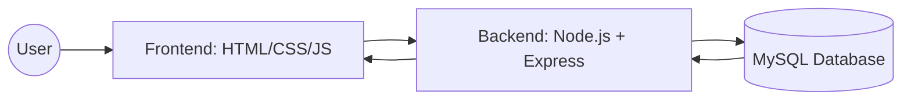

# 🏥 Health Management System

[](https://opensource.org/licenses/MIT)
[](https://nodejs.org/)
[](https://www.mysql.com/)

A professional, production-grade **Health Management System** designed to streamline hospital operations. This full-stack application enables efficient management of patients, doctors, and appointments through a robust REST API and a relational database architecture.

---

## 📌 Project Overview

This project is a comprehensive **Database Management System (DBMS)** implementation that handles core hospital workflows:
- **Patient Management:** Complete CRUD operations for patient records.
- **Doctor Directory:** Maintain a list of specialized medical professionals.
- **Appointment System:** Book and track medical consultations with relational data integrity.

The system is built with a focus on **security**, **modular architecture**, and **performance**, utilizing MySQL's relational capabilities to ensure data consistency.

---

## 🏗️ Architecture & Flow

The application follows a classic **3-Tier Architecture**:



1.  **Frontend:** A responsive, modern UI built with Vanilla HTML5, CSS3, and JavaScript.
2.  **Backend:** A modular Express.js server implementing RESTful principles, controllers, and middleware.
3.  **Database:** A normalized MySQL schema ensuring ACID compliance and referential integrity via Foreign Keys.

---

## 🛠️ Tech Stack

-   **Frontend:** HTML5, CSS3 (Glassmorphism UI), JavaScript (ES6+)
-   **Backend:** Node.js, Express.js
-   **Database:** MySQL 8.0+
-   **Environment Management:** Dotenv
-   **API Handling:** CORS, Express JSON Parser
-   **Tools:** VS Code, Git, MySQL Workbench

---

## 🗄️ Database Design

The database is designed with high normalization to prevent data redundancy.

### Tables:
-   **`Patients`**: Stores personal details (Name, Age, Gender, Contact, Address).
-   **`Doctors`**: Stores professional profiles (Name, Specialization, Contact).
-   **`Appointments`**: The junction table linking Patients and Doctors with a specific date and status.

### Relationships:
-   **One-to-Many:** One patient can have multiple appointments.
-   **One-to-Many:** One doctor can have multiple appointments.
-   **Foreign Keys:** `patient_id` and `doctor_id` in the `Appointments` table ensure that appointments only exist for valid entities.

---

## 🚀 Setup Instructions

Follow these steps to get the project running locally:

### 1. Prerequisites
-   [Node.js](https://nodejs.org/) installed
-   [MySQL Server](https://www.mysql.com/downloads/) installed and running

### 2. Clone the Repository
```bash
git clone https://github.com/dablu022/Health-Management-System.git
cd Health-Management-System
```

### 3. Database Setup
1.  Log in to your MySQL terminal or Workbench.
2.  Run the schema script located in `database/schema.sql`:
    ```sql
    source database/schema.sql;
    ```

### 4. Backend Configuration
1.  Navigate to the backend directory:
    ```bash
    cd backend
    ```
2.  Install dependencies:
    ```bash
    npm install
    ```
3.  Create a `.env` file from the example:
    ```bash
    cp ../.env.example .env
    ```
4.  Update the `.env` file with your MySQL credentials:
    ```env
    DB_HOST=127.0.0.1
    DB_USER=root
    DB_PASSWORD=your_password
    DB_NAME=health_management_system
    ```

### 5. Run the Application
1.  Start the server:
    ```bash
    npm start
    ```
2.  Open `frontend/index.html` in your favorite browser.

---

## 📡 API Endpoints

| Method | Endpoint | Description |
| :--- | :--- | :--- |
| **GET** | `/api/patients` | Retrieve all patients |
| **POST** | `/api/add-patient` | Register a new patient |
| **DELETE** | `/api/patients/:id` | Remove a patient record |
| **GET** | `/api/doctors` | List all doctors |
| **POST** | `/api/appointments` | Book a new appointment |
| **GET** | `/api/appointments` | Get appointments with joined data |

---

## ⚠️ Engineering Challenges

-   **Database Connectivity:** Implementing a **Connection Pool** to handle multiple concurrent requests efficiently without exhausting database resources.
-   **Referential Integrity:** Handling `ON DELETE CASCADE` and foreign key constraints to prevent orphaned appointment records.
-   **CORS Management:** Configuring Cross-Origin Resource Sharing to allow the frontend to securely communicate with the backend API.
-   **State Management:** Synchronizing the UI state with real-time database changes using async/await patterns in the frontend.

---

## 🚀 Future Roadmap

-   [ ] **Authentication:** Implement JWT-based login for Admins and Doctors.
-   [ ] **Role-Based Access (RBAC):** Different permissions for Receptionists and Medical Staff.
-   [ ] **React Migration:** Upgrade the frontend to React for better component reusability.
-   [ ] **Notifications:** Email/SMS alerts for upcoming appointments.
-   [ ] **Cloud Integration:** Deployment via AWS or Heroku with a managed MySQL instance.

---

## 📂 Repository Structure

```text
├── backend/
│   ├── config/         # DB connection pool setup
│   ├── controllers/    # Business logic for routes
│   ├── routes/         # Express route definitions
│   ├── server.js       # Main entry point
│   └── package.json
├── frontend/
│   ├── index.html      # Main UI
│   ├── style.css       # Custom styling
│   └── script.js       # API integration logic
├── database/
│   └── schema.sql      # Database initialization script
├── docs/               # Architecture diagrams & documentation
├── .env.example        # Environment variable template
└── .gitignore          # Production-grade git rules
```

---

## 👨‍💻 Author

**Dablu**  
*Full Stack Developer & DBMS Enthusiast*  
[GitHub](https://github.com/dablu022) | [LinkedIn](https://linkedin.com/in/your-profile)

---

## ⚖️ License

This project is licensed under the MIT License - see the [LICENSE](LICENSE) file for details.
